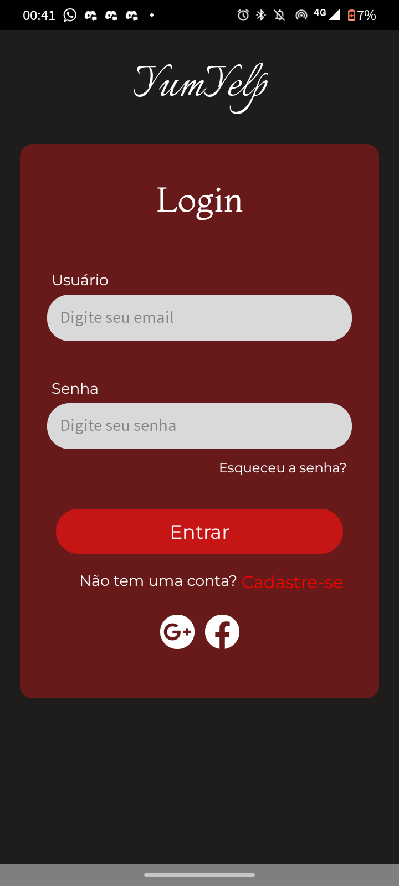
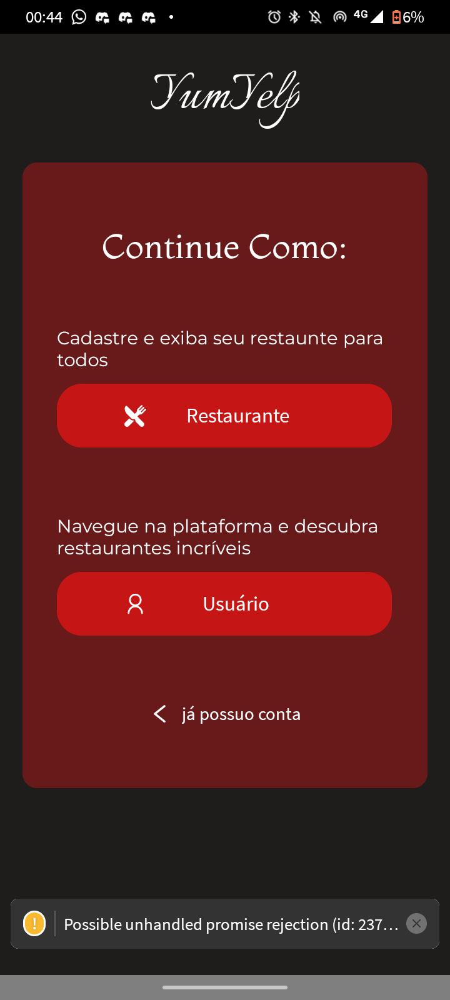
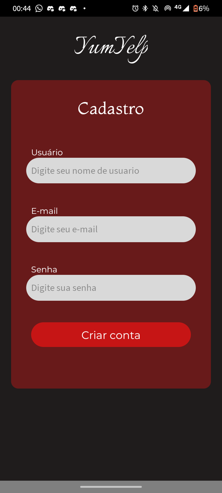
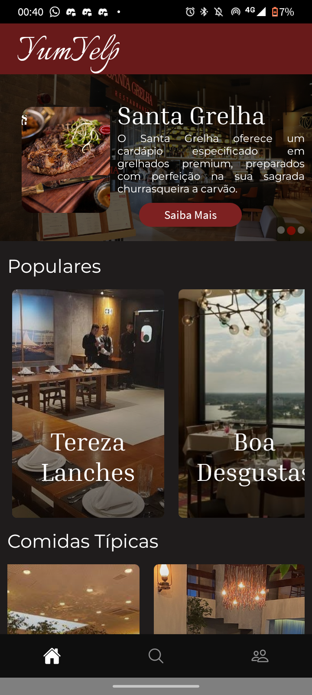
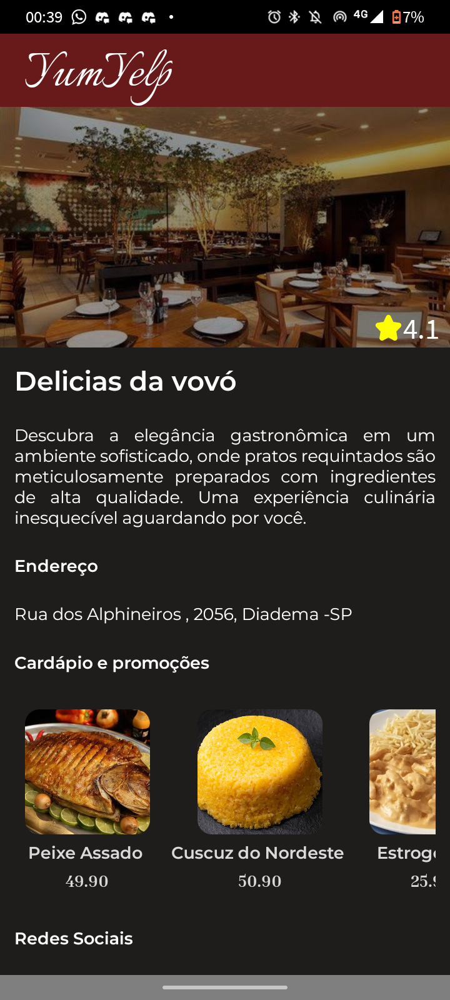
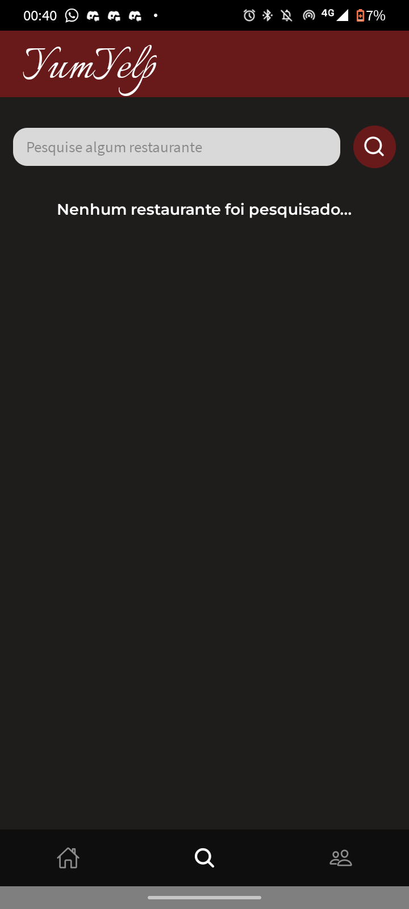
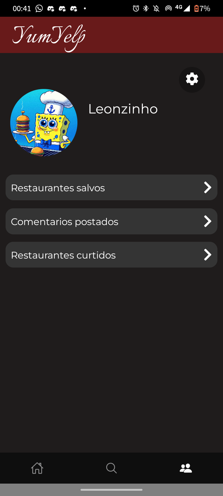
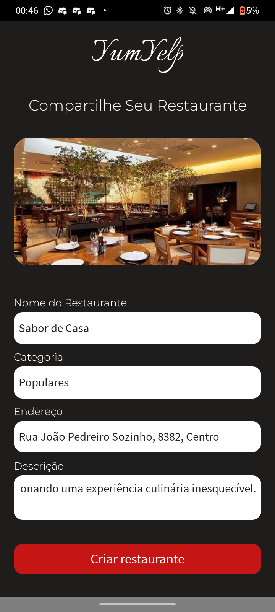
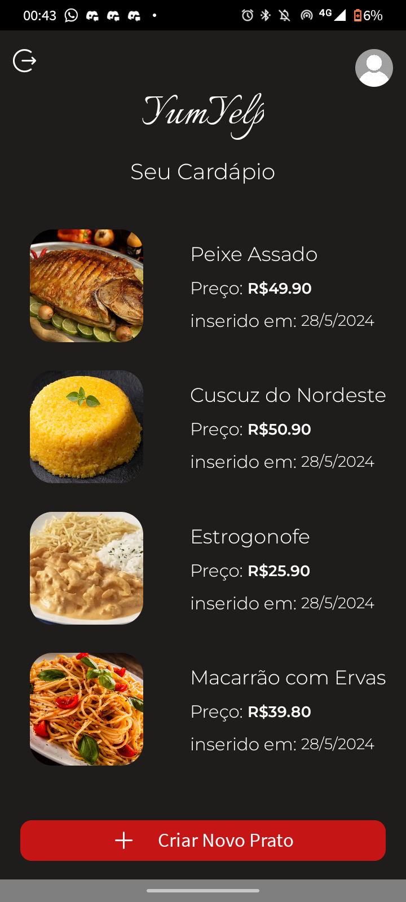

<div align="center" id="top"> 
  

  &#xa0;

  <!-- <a href="https://yumyelp.netlify.app">Demo</a> -->
</div>

<h1 align="center">Aplicativo de recomendação de restaurante com React Native</h1>


<br>

## Sobre ##

O Yumyelp é um aplicativo com o ituíto de conectar clientes á boas recomendações de restaurantes. Na aplicação conseguimos atender requisitos na visão do restaurante, que deseja compartilhar sua imagem e qualidade ao cliente tendo como principais funcionalidades o registro de seu restaurante e também registros dos principais pratos de cardápios. Já na parte do cliente ele terá acesso aos restaurantes registrados podendo analisar a melhor opção de restaurante para ir através de avalições deixadas por outros clientes. 


<p align="center">
 <h2 align="center">
  
  
  
 <h2>

  <!--  -->

  <!--  -->
</p>
<p align="center">
  <h2 align="center">
  
  
   
   
  </h2>
  <!--  -->

  <!--  -->
</p>
<p align="center">
  <h2 align="center">
  
  
  
  </h2>

  <!--  -->

  <!--  -->
</p>

<!-- Status -->

<!-- <h4 align="center"> 
	🚧  Yumyelp 🚀 Under construction...  🚧
</h4> 

<hr> -->
## :white_check_mark: Requirements ##

Before starting :checkered_flag:, you need to have [Git](https://git-scm.com) and [Node](https://nodejs.org/en/) installed.

## :checkered_flag: Starting ##

```bash
# Clone this project
$ git clone https://github.com/{{YOUR_GITHUB_USERNAME}}/yumyelp

# Access
$ cd yumyelp

# Install dependencies
$ yarn

# Run the project
$ yarn start

# The server will initialize in the <http://localhost:3000>
```

## Tecnologias ##


- [Expo](https://expo.io/)
- [Node.js](https://nodejs.org/en/)
- [React](https://pt-br.reactjs.org/)
- [React Native](https://reactnative.dev/)


## :memo: License ##

This project is under license from MIT. For more details, see the [LICENSE](LICENSE.md) file.

[](https://github.com/LeonanAraudo)

Made with :heart: by <a href="https://github.com/{{YOUR_GITHUB_USERNAME}}" target="_blank">{{YOUR_NAME}}</a>

&#xa0;

<a href="#top">Back to top</a>
